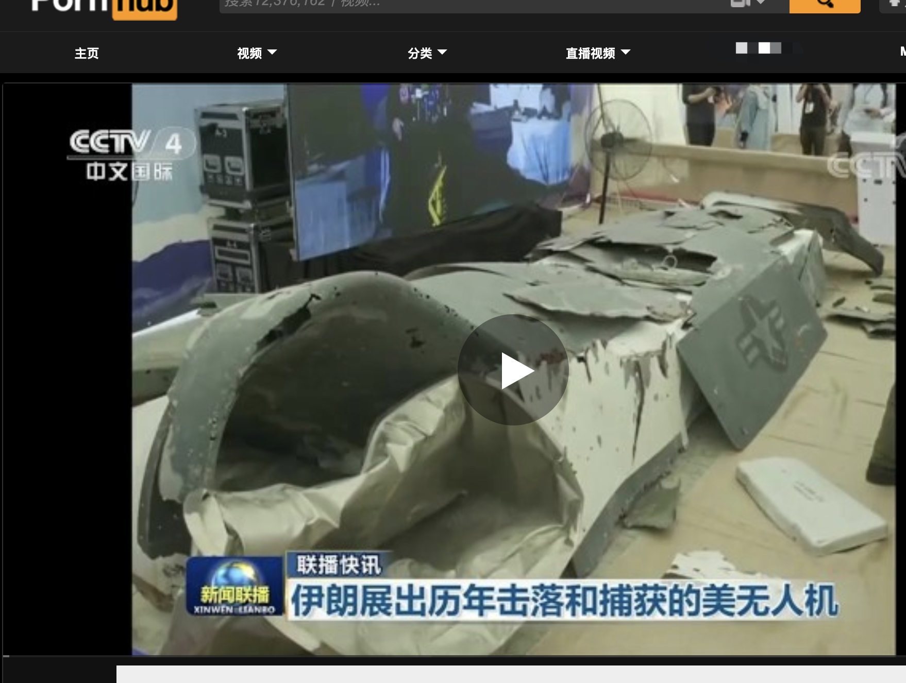
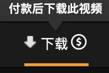
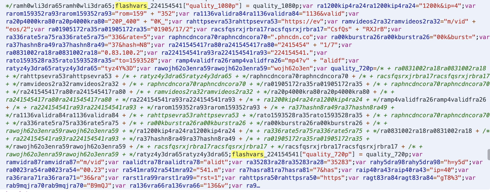
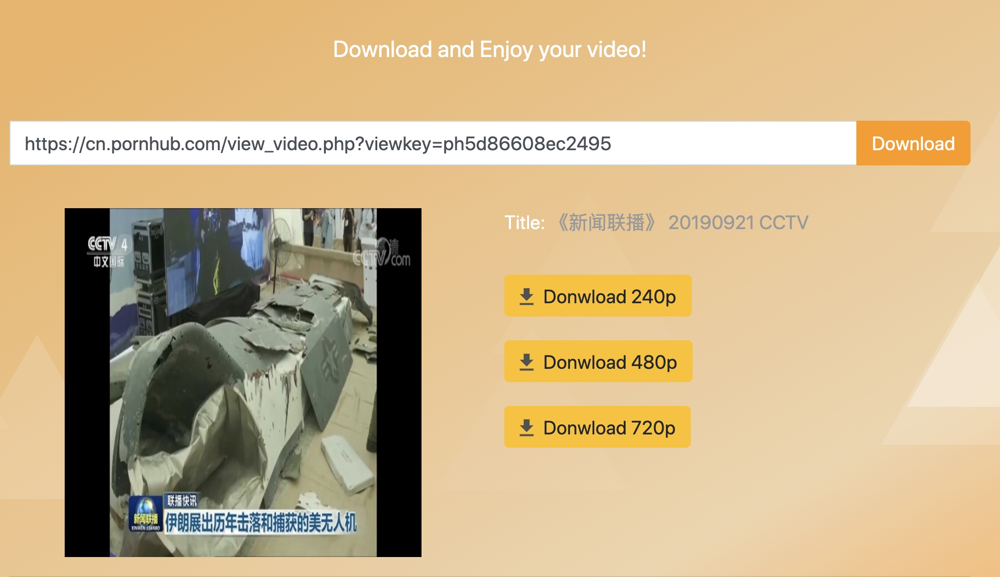

## 手把手教你写Pornhub视频下载Chrome插件

今天带大家开发一个 Chrome 浏览器插件，主要功能是下载P站视频，如果还不知道P站是干嘛的，嗯。。。那还是不要往下看了，这趟车最好不要上。

P站是个学习的好地方，比如看新闻联播什么的。
 


但他需要登录才能下载高清视频，有的视频还需要付费下载。但是这种怎么能阻挡我们学习的好奇心呢。



#### 如何下载P站高清视频
打开 Devtools， 审查元素，找到 flashvars 变量，之前的版本是直接能在这个变量下看到视频地址。



现在前端做了混淆，不能直接看到，但是只要执行完 js，地址依然能轻松拿到。我们打印 flashvars_224154541 的值。可以看到有4种格式的视频 cdn 地址。


看样子需要一个 js 引擎去执行这段代码。网上查了下，有个神奇的项目居然能完美下载P站视频，应该很多小伙伴都用过： https://github.com/ytdl-org/youtube-dl

看了下他的代码，实现逻辑也跟上面的差不多，详见：https://github.com/ytdl-org/youtube-dl/blob/fa9b8c662808a50605bb05f90af101e13b30fce6/youtube_dl/extractor/pornhub.py

好了，轮子别人已经做好了，我们只要实现个转换的 web server 的接口就行。

``` python

def get_download_urls(url):
    ydl_opts_start = {'forcejson': True, 'simulate': True, 'skip_download': True, 'quiet': True}

    f = io.StringIO()
    with redirect_stdout(f):
        ydl = youtube_dl.YoutubeDL(ydl_opts_start)
        ydl.download([url])
    result = f.getvalue()
    result = json.loads(result) if result else {}
    return result
```


#### Chrome 插件开发

Chrome 插件的作用是拿到用户访问的 url，提交给服务器即可。

我们先创建一个 manifest.json，相当于插件的一个配置文件。

```
{
	"manifest_version": 2,
	"name": "P站视频高清下载",
	"version": "1.1",
	"description": "下载高清P站高清视频",
	"author": "laosiji",
	"icons":
	{
		"48": "icon.png",
		"128": "icon.png"
	},
	"browser_action": 
	{
		"default_icon": "icon.png",
		"default_popup": "popup.html"
	},
	"permissions": ["activeTab"]
}
```

由于插件非常简单，用不着 background.js content-script.js ，只需声明 activeTab 的权限。

接下来，我们创建一个 popup.html 作为和用户的交互界面，html 里面包含一个 popup.js 

```
chrome.tabs.query({ active: true, currentWindow: true }, function (tabs) {
	url = tabs[0].url
	title = tabs[0].title
	if (url != undefined && url.match(/https:\/\/.*?\.pornhub\.com\/view_video\.php\?viewkey=.*/)) {
		html = '<h5>' + title +'</h5>'
		html += '<a target="_blank" href="https://mydownload.fun/download?url='+ url +'"><span class="btn">Download</span></a>'	
		$("#video_info").append(html)

	}
})
```

将开发完的插件加载到浏览器中，然后在P站页面点击浏览器右上角的插件，可以看到如下弹窗。


点击 Download 跳转至网站页面，即可下载高清视频。




#### 总结

本次教程忽略了一些细节，比如前端 html 的制作，如何打包一个插件，这部分内容可参见我翻译的谷歌浏览器扩展官方文档：https://dev.crxhome.org

其实解析视频这块，直接用 js 执行也能得到结果，而且还不依赖后端 api。我开发后端的转换 api，主要原因如下:

1. 插件有更新问题，一旦解析逻辑失效，需要重新审核上线，或者一些无法更新的用户就会没法使用。
2. 网站可以不依赖插件运行，相对限制更少，更通用。


#### 安装

最后把 Demo 放出来给大家试用吧，在公众号「程序化思维」回复 demo ，最后下载拿到一个 zip 文件。

谷歌浏览器访问 chrome://extensions 后，直接将 zip 文件拖拽进页面安装即可。


